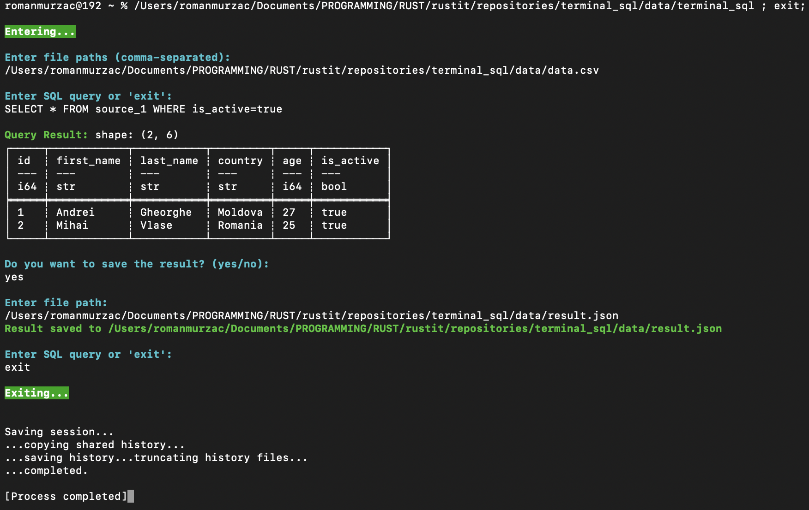
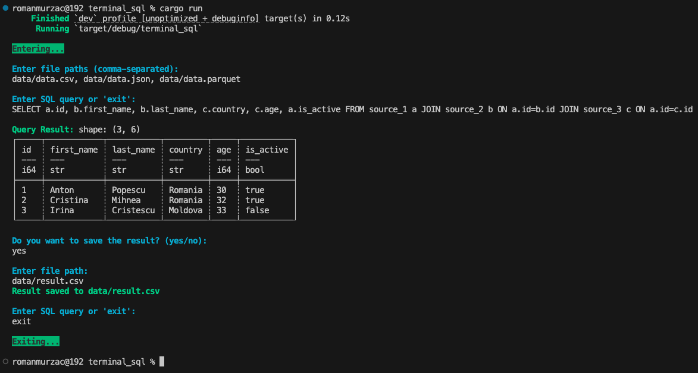

# TerminalSQL

# Your Project Name


## Overview
Run SQL query on your local files directly in terminal.

This project provides a SQL query execution framework using the [**Rust**](https://www.rust-lang.org/) programming language and [**Polars**](https://docs.rs/polars/latest/polars/) library. It includes modules for file handling, query execution, and utility functions to facilitate working with data.

## Features
- Read data files
- Execute SQL queries
- Write data files

## Legend
In the TerminalSQL there are 5 used [ANSI colors](https://talyian.github.io/ansicolors/) for the messages:
- **user input**: foreground white - `\x1b[37m` - user input in the terminal.
- **indication message**: foreground cyan - `\x1b[36m` - expect input in the terminal from the user.
- **success message**: foreground green - `\x1b[32m` - successful execution of the user input.
- **error message**: foreground red - `\x1b[31m` - erorr occured during execution of the user input.
- **start/finish message**: background green - `\x1b[42m` - start and finish of the program execution.

## App
For **MacOS** the app can be downloaded [`here`](app/TerminalSQL-MacOS.tar.gz).

Notes:
- Enter absolute path for the files.
- Separate files by a comma.
- Each file is available in the query as `source_1`, `source_2`, etc.



## Installation
Ensure you have **Rust** installed. If not, install it using [Rustup](https://rustup.rs/):
```sh
curl --proto '=https' --tlsv1.2 -sSf https://sh.rustup.rs | sh
```

Clone the repository:
```sh
git clone https://github.com/romanmurzac/terminal_sql.git
cd terminal_sql
```

Build the project:
```sh
cargo build
```

## Usage
Check the project:
```sh
cargo check
```

Run the project:
```sh
cargo run
```

Run the tests:
```sh
cargo test
```



## Project Structure
```
project/
├── app/
│   ├── terminal_sql.exe      # Executable app for Windows
│   ├── terminal_sql          # Executable app for MacOS
├── data/
│   ├── data.csv              # Test CSV file
│   ├── data.json             # Test JSON file
│   ├── data.parquet          # Test Parquet file
├── src/
│   ├── file_io.rs            # File processing logic
│   ├── query.rs              # Query execution logic
│   ├── utils.rs              # Utility functions
│   ├── main.rs               # Entry point
│   ├── lib.rs                # Modules declaration
├── tests/
│   ├── integration_tests.rs  # Integration tests
├── Cargo.toml                # Rust package configuration
└── README.md                 # Project documentation
```

## Modules

### `file_io`
Handles reading data files.
```rust
/// Reads a file and returns its contents as a string.
pub fn read_file(path: &str) -> Result<String, String> {
}
```

Handles writing data files.
```rust
/// Saves the DataFrame to a file.
pub fn save_file(df: &mut DataFrame, filename: &str) -> PolarsResult<()> {
}
```

### `query`
Mentain the logic for the continuous running.
```rust
/// Loop to process user SQL queries.
pub fn query_loop(ctx: &mut SQLContext) -> io::Result<()> {
}
```

Executes SQL queries.
```rust
/// Executes a SQL query on a given Polars SQLContext.
pub fn execute_query(ctx: &mut SQLContext, query: &str) -> Result<(), String> {
}
```

Keep the logic for the query result.
```rust
/// Handles the query result and provides an option to save it.
pub fn handle_query_result(df: &mut DataFrame) -> io::Result<()> {
```

### `utils`
Utility functions for user input and error handling.
```rust
/// Prompts the user for input and returns the response.
pub fn user_input(input: &str) -> Result<String, String> {
}
```

## Contributing
Feel free to fork this repository and submit a pull request with improvements!

## License
This project is licensed under the MIT License.

